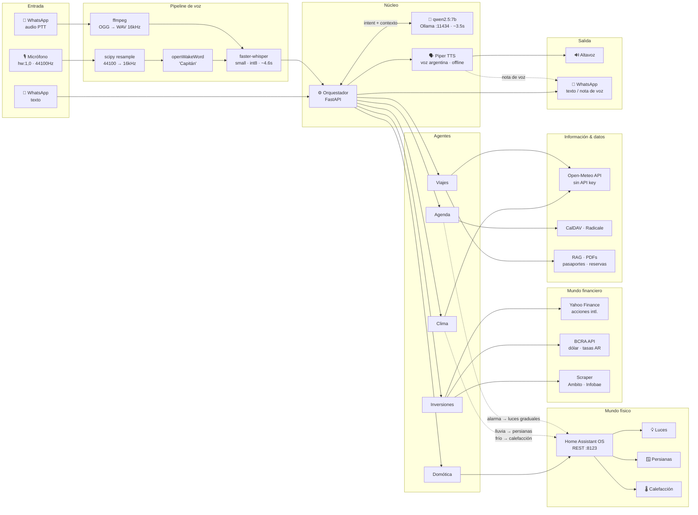

# home-agents

A local-first, privacy-preserving multi-agent system running entirely on a laptop — no cloud, no subscriptions, no data leaving the house.

Built on Gentoo Linux with an AMD Ryzen 9 5900HX (64GB RAM). Every component runs on CPU: speech recognition, language models, text-to-speech, and home automation control.

---

## What it does

You say **"Capitán"** → the system wakes up → listens to your command → understands it → acts on it → speaks back.

```
Microphone (44100Hz)
    ↓  resample → 16000Hz
faster-whisper          ~4.6s   speech to text
    ↓
qwen2.5:7b (Ollama)     ~3.5s   intent + action
    ↓
Home Assistant REST API         execute
    ↓
Piper TTS                       spoken confirmation
```

Total latency: ~8s warm / ~15.7s cold start.

---

## Architecture



> Líneas sólidas: flujo principal. Líneas punteadas: integraciones cruzadas entre agentes (domótica reaccionando a clima, agenda, etc).

---

## Stack

| Layer | Tool | Notes |
|---|---|---|
| Wake word | openWakeWord (custom trained) | "Capitán", ONNX model |
| STT | faster-whisper `small` int8 | Spanish, CPU |
| LLM | qwen2.5:7b via Ollama | 3.5s warm, correct ACTION format |
| TTS | Piper v1.2.0 | Argentine + Spanish voices |
| Home automation | Home Assistant OS | REST API only, local network |
| Audio capture | PyAudio + scipy resample | ALC256 → 44100→16000Hz |

---

## Roadmap

### Phase 1 — Voice agent for home automation `~70% done`
End-to-end pipeline: wake word → STT → LLM → Home Assistant action → TTS confirmation.

### Phase 2 — Smarter home agent
RAG over live HA state, ambiguity handling, conversation history, satellite mics in rooms.

### Phase 3 — Multi-agent orchestrator
FastAPI orchestrator routing intents across agents, shared memory, unified API, observability.

### Phase 3.5 — WhatsApp channel
Send text or voice notes to the orchestrator from WhatsApp. Authorized numbers only. Audio messages go through the same STT pipeline as the microphone. Responses optionally sent back as voice notes.

### Phase 4 — Weather agent
Open-Meteo integration (no API key). Proactive alerts: rain → close blinds, cold → adjust heating.

### Phase 5 — Calendar agent
Local CalDAV (Radicale). Voice queries and reminders. Wake-up lighting triggered by agenda events.

### Phase 6 — Investment agent
Local portfolio tracking. Argentine and international markets. All financial data stays on the local network.

### Phase 7 — Travel agent
RAG over travel documents (passports, reservations). Destination weather, itinerary planning, expiry alerts.

### Phase 8 — Hardware upgrade
Dedicated always-on server, discrete GPU for fine-tuning, larger models (qwen2.5:32b fits in 64GB RAM).

---

## Design decisions

- **Everything local.** No API keys, no external services, no telemetry. The only network boundary is the LAN between the laptop and Home Assistant.
- **CPU-only inference.** The integrated Radeon Vega 8 shares RAM and is not useful for ML. All models run on CPU with int8 quantization.
- **Audio resampling.** The ALC256 soundcard doesn't support 16kHz (required by Whisper and openWakeWord). Audio is captured at 44100Hz and resampled with `scipy.signal.resample_poly` (up=160, down=441).
- **qwen2.5:7b over phi3.** phi3:mini was too slow (24.8s) and invented entity IDs. phi3-ha also invented IDs. qwen2.5:7b gives consistent ACTION format in 3.5s.
- **Piper over cloud TTS.** Four Spanish/Argentine voice models run fully offline.
- **ffplay over aplay.** aplay requires explicit format parameters with this soundcard; ffplay handles it cleanly.

---

## Project layout

```
~/ai-lab/
├── masterplan/estado.md    full plan with status and decisions
├── wakeword/
│   ├── openWakeWord/       cloned repo
│   ├── data/capitán/       training samples (positive/negative)
│   └── generate_samples_multi.py
├── ha-bridge/              orchestrator / HA connector
├── scripts/                benchmarks, monitors, test utilities
├── models/                 GGUF models
└── logs/
```

---

## Status

Active development. Phase 1 is ~70% complete. See [`masterplan/estado.md`](masterplan/estado.md) for the detailed task list, latency numbers, and open decisions.
