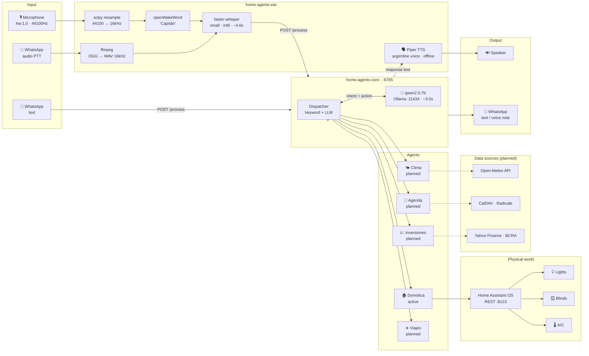

# home-agents

A local-first, privacy-preserving multi-agent system running entirely on a laptop — no cloud, no subscriptions, no data leaving the house.

Built on Gentoo Linux with an AMD Ryzen 9 5900HX (64GB RAM). Every component runs on CPU: speech recognition, language models, text-to-speech, and home automation control.

---

## What it does

You say **"Capitán"** → the system wakes up → listens to your command → understands it → acts on it → speaks back.

```
ear/listen.py
  Microphone (44100Hz)
      ↓  resample → 16000Hz
  openWakeWord          wake word detection
      ↓
  faster-whisper        ~4.6s   speech to text
      ↓
  HTTP POST :8765/process
      ↓
core/server.py
  qwen2.5:7b (Ollama)   ~3.5s   intent + action
      ↓
  Home Assistant REST   execute
      ↓
ear/listen.py
  Piper TTS             spoken confirmation
```

Total latency: ~8s warm / ~15.7s cold start.

---

## Architecture



> Solid lines: current implementation. Dashed lines: planned integrations.

---

## Repositories

| Repo | Purpose |
|------|---------|
| [`home-agents`](https://github.com/mblasi/home-agents) | Umbrella — masterplan, scripts, submodules |
| [`home-agents-ear`](https://github.com/mblasi/home-agents-ear) | Audio interface: mic, wake word, STT, TTS, dashboard |
| [`home-agents-core`](https://github.com/mblasi/home-agents-core) | Agent logic: FastAPI :8765, LLM dispatch, HAOS client |

```
home-agents/
├── ear/          → submodule: home-agents-ear
├── core/         → submodule: home-agents-core
├── masterplan/   → estado.md (full task list + decisions)
├── scripts/      → sync_issues.py
└── interagent/   → product concept (Interagent network)
```

---

## Quick start

```zsh
# Clone with submodules
git clone --recurse-submodules git@github.com:mblasi/home-agents.git ~/ai-lab

# Configure credentials
cp ~/ai-lab/core/.env.example ~/ai-lab/core/.env   # add HAOS_URL + HAOS_TOKEN
cp ~/ai-lab/ear/.env.example  ~/ai-lab/ear/.env    # set CORE_URL=http://localhost:8765

# Activate Python environment
source ~/ai-env/bin/activate

# Start core, then ear
systemctl --user start capitan-core
systemctl --user start capitan

# Or interactively with dashboard
cd ~/ai-lab/core && uvicorn server:app --host 127.0.0.1 --port 8765
bash ~/ai-lab/ear/dashboard.sh
```

See [`ear/`](ear/) and [`core/`](core/) for detailed setup of each component.

---

## Stack

| Layer | Tool | Notes |
|-------|------|-------|
| Wake word | openWakeWord (custom trained) | "Capitán", ONNX model, threshold 0.8 |
| STT | faster-whisper `small` int8 | Spanish, CPU, ~4.6s |
| LLM | qwen2.5:7b via Ollama | 3.5s warm, correct ACTION format |
| TTS | Piper v1.2.0 | `es_AR-daniela-high` voice, offline |
| Home automation | Home Assistant OS | REST API only, LAN |
| Audio capture | PyAudio + scipy resample | ALC256 → 44100→16000Hz |
| Agent API | FastAPI + uvicorn | :8765, POST /process |

---

## Roadmap

### Phase 1 — Voice agent for home automation `complete`
End-to-end pipeline: wake word → STT → HTTP → LLM → Home Assistant action → TTS.
Modular architecture: `ear` and `core` as independent repos communicating via REST.

### Phase 2 — Smarter home agent
RAG over live HA state, ambiguity handling, conversation history, satellite mics in rooms.

### Phase 3 — Multi-agent orchestrator
Intent routing across agents, shared memory, unified API, observability dashboard.

### Phase 3.5 — WhatsApp channel
Text and voice notes to the orchestrator from WhatsApp. Authorized numbers only.

### Phase 4 — Weather agent
Open-Meteo integration (no API key). Proactive alerts: rain → close blinds, cold → adjust heating.

### Phase 5 — Calendar agent
Local CalDAV (Radicale). Voice queries and reminders.

### Phase 6 — Investment agent
Local portfolio. Argentine and international markets. All financial data stays on LAN.

### Phase 7 — Travel agent
RAG over travel documents. Destination weather, itinerary planning, expiry alerts.

### Phase 8 — Dedicated server
Always-on hardware, discrete GPU, larger models (qwen2.5:32b in 64GB RAM).

---

## Design decisions

- **Everything local.** No API keys, no external services, no telemetry. The only network boundary is the LAN between the laptop and Home Assistant.
- **CPU-only inference.** The integrated Radeon Vega 8 shares RAM and is not useful for ML. All models run on CPU with int8 quantization.
- **ear ↔ core over HTTP.** Separating audio I/O from agent logic via a REST boundary allows multiple `ear` instances (rooms, WhatsApp) to share one `core`.
- **Audio resampling.** The ALC256 doesn't support 16kHz. Audio is captured at 44100Hz and resampled with `scipy.signal.resample_poly` (up=160, down=441).
- **qwen2.5:7b over phi3.** phi3:mini was too slow (24.8s) and invented entity IDs. qwen2.5:7b gives consistent ACTION format in 3.5s.
- **Piper over cloud TTS.** Four Spanish/Argentine voice models run fully offline.
- **ffplay over aplay.** aplay requires explicit format parameters with this soundcard.

---

## Status

Phase 1 complete. See [`masterplan/estado.md`](masterplan/estado.md) for the full task list, latency numbers, and open decisions.
